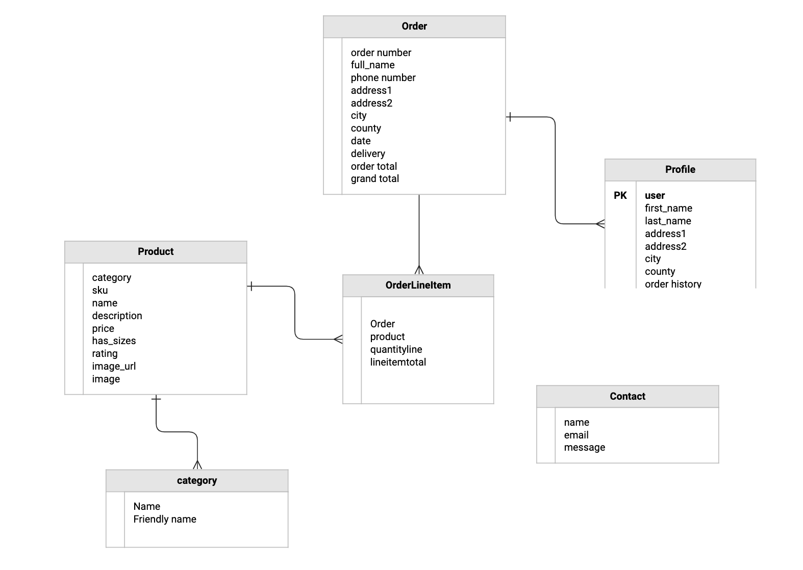
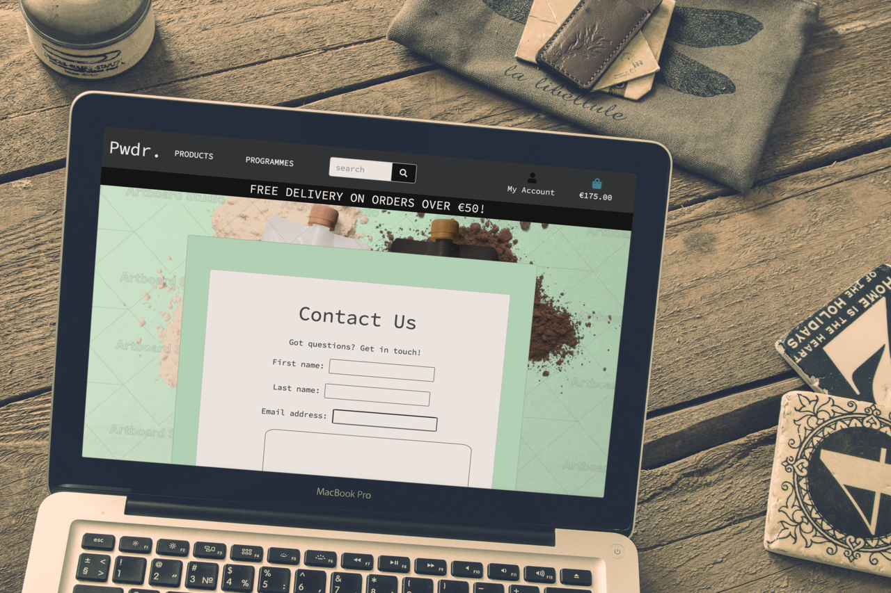

# Pwdr.

Pwdr is a fitness brand, selling healthy vegan powder, bars, merchandise and fitness programmes. 
But really, Pwdr isn't a brand - it's more of a *lifestyle*.


## UX
 
### Navigation
#### Customer
- As a first time customer, I want to find and purchase products.
- As a first time customer, I want to be able to search.
- As a first time customer, I want see what this site/service can offer
- As a first time customer, I want the option to sign up and add my own listing. 

### Registration & User Accounts
#### Site User
- As a site user, I want to register for an account simply.
- As a site user, I want to login/out easily.
- As a site user, I want to get email registration confirmation when I signup.
- As a site user, I want to see personalised info including: order information.
- As a site user, I want to edit my address or other account elements

### Sorting & Searching
#### Customer
- As a customer, I want to see a list of available products/programmes.
- As a customer I want to sort the categories of products/programmes.
- As a customer I want to search by product name.
- As a customer I want to get back to the homepage from anywhere.

### Purchasing & Checkout
#### Customer
- As a customer, I want to view items in bag.
- As a customer, I want to edit items in bag.
- As a customer, I want to easily checkout.
- As a customer, I want to see an order confirmation.
- As a customer, I want to receive a confirmation email.
- As a customer, I want to have confidence in the security of this site.

#### Super User
- As an administrator, I want the option to edit any product/programme I need to. 
- As an administrator, I want the option to delete any product/programme I need to.
- As an administrator, I want the option to add any product or programme.

### Design

-   #### Colour Scheme
    -   The main colours used are Black and white, with occasional avocado green to match the tones of the background image. 
-   #### Typography
    -   The Source Code Pro font is the main font used throughout the site. This font was chosen for its simplicity.
-   #### Imagery
    -   The main background image is a mocked up product shot of fictional product Pwdr Sport.
-   #### Layout
    -   Bootstrap was used to assist with the layout and styling of this site. 

### Wireframes

- The wireframes for this site were created using Figma, and are viewable [here](https://www.figma.com/file/5EMRswrUyHlPLnpPgGfiPw/Milestone-4).

### Database 
- Here is the schema for the store's database:



---

## Testing
### Manual Testing.
### Functionality
1. Search function:
    - Go to the Home page
    - Try to submit an empty search and verify that an error message about the required fields appears
    - Try to submit a search with less than 3 letters verify that a relevant error message appears
    - Try to submit a search with all inputs valid and verify that a success message appears.

2. Login Page:
    - Try to submit incorrect login details and verify an error appears.

3. Register Page
    - Try to register using an existing username and verify error appears
    - Try to register a username using fewer than 3 letters and verify error appears. 

4. Product Page:
    - Attempt to add a number of products exceeding 99.
    - Attempt to click on a sum of zero products.

5. Checkout Page:
    - Attempt to enter an email address without an @ symbol to trigger an error.
    - Attempt to include text in the phone numbers field to trigger an error.
    - Enter invalid credit card number - this will trigger an error.

## 3. Validators

 - **[HTML Validator](https://validator.w3.org/):** No errors found.
    
    **Result:** 
    - 

- **[CSS Validator](https://jigsaw.w3.org/css-validator/):** No errors found.

    **Results:**
    - 


- **[JS Hint](https://jshint.com/):** No errors found.
    
    **Results:**
    - Warnings 
    - 

- **[Python validator | PEP8](http://pep8online.com/):** No errors found

    **Results:** No errors found!

---

### Existing features 

#### 1. Navbar
- The site name is clearly visible in the left of the navbar. The name redirects to the home page. 
- The navbar contains the **search functionality**, where the user can search for products using full or partial words. 
    - The search functionality allows users to enter keywords associated with the name or the description of the product. 
    - The search results are displayed on the products page. 
    - On the product page, a message will appear with ‘no results’ if there are no search results.
- The navbar contains the **profile icon**, where users can login, register and go to their profile.
- The navbar contains the **shopping bag**, where users can see their cart. The basket redirects to the bag page. 
- There is a section with a **products** dropdown listing the products that are in store. 
- There is a section with a **programmes** dropdown listing the programmes that are in store. 


#### 2. Footer
- **Relevant links**  FAQs, About Us and Contact are placed at the bottom of the footer.
- The **social media links** are placed beneath the preceding elements. 


#### 3. Home page 
- The home page serves as an stylised introduction to the webstore's 'brand'.
- An image of two pwdr products serves as background image
- There is a 'shop now' button leading to all products.

#### 4. Product page 
- The All Product page contains all products.
- There are 3 Product **categories** displayed on the All Products page: Powders, Bars and Merch.
- The items can be **sorted** by name A-Z, Z-A, price from high to low and price from low to high.

#### 5. Programme page 
- The All Programmes page contains all programmes.
- There are 3 Programme **categories** displayed on the All Programmes page: Couch to 5k, Vegan Vigour, Pwdr Workout Club.
- The items can be **sorted** by name A-Z, Z-A, price from high to low and price from low to high.

#### 6. Product Detail page 
- **The product detail page shows information about that specific item**, the information includes; name, image, price and the product description. 
- A user can **choose the quantity** of the product. The product quantity can be between 1 and 99 items. 
- A user can **see the size** of the product, if applicable. 
- There is a button where the user can **add the product/programme to the shopping bag**.
    - When the user  puts the item in the bag there will be a toast success message.
    - When the user puts the item in the bag, the shopping bag in the navbar will show the number of items that are in the shopping bag.
- There is a **‘Back’** link that redirects to the Products page. 

#### 7. The Shopping page
- Users who are logged in and even those who aren't can make purchases.
- Gives **an overview of all items** that are in the shopping bag, the overview information includes; image, name, size, quantity, price and subtotal.
- users can **update the quantity** of the items they have.
- users can **remove items** from their order.
- There's an **overview of the total price, the delivery costs and the grant total** of the order.
- There's a button with **‘keep shopping’** that links to the product page. 
- There's a button with **‘go to checkout’** to continue the purchase.


#### 8. Checkout page 
- The **order summary** gives information about the item, including: name, size, price, total, delivery costs and grand total. 
- There is an option to **login with an account**, where the personal and delivery information already exists to continue the payment process quickly. 
- **The checkout form** to continue the payment. The form asks for the following information: full name, email, phone number, country, postal code, town or city and  street address 1 - all these input fields must be valid. The country field is an input where users can scroll to a list to choose the country.
- At the end of the checkout form there is an option to **save** the delivery information to an account. This function only shows when the user is authenticated.
- The user has to fill in their information about the card number. The Stripe functionality is in testing mode, the credit card number **4242 4242 4242 4242** will lead to a successful payment. expiration date, CVC and ZIP can be made up yourself.
- A **webhook** is used for security when the order is processed, even in the case when the payment process is interrupted.
- There is a **button to go back to the shopping bag page.** The user can go back to the shopping bag page to adjust items in the bag.
- There is a button to **complete the order**.
- When the user clicks on the complete the order button, there is a little **loading overlay**. The user is directed to the checkout success page after the overlay. 
- **When the order is completed:**
    - There is a redirect to the checkout success page.
    - A confirmation email is sent to the user’s mail.
    - A toast message ‘completed’ shows to ensure the user that the order is successfully completed.

#### 9. Checkout success page
- Contains a **confirmation message**.
- Includes information about the **order summary**. The order summary consists of information about the date, order number, products, delivery information and billing information. 
- There is a button to go back to the product page.

#### 10. The Profile page 
- The account page is only accessible for users who have an account. 
- The page contains a **personal info section** (username, email). The user can change the password and edit their email. 
- There is a shipping **info section** (country, postal code, town/city, street address 1 & 2. Users can **edit this information** also. 
- There is an **order history** section (order number, date of order, items and total).
#### 11. FAQ page 
- This page contains all relevant questions (text generated from a FAQ text generator).

#### 12. Contact page 
- Users can reach out to Pwdr via the **contact form**. The user has to fill in their name, email and message. The form will be sent to the admin. 



#### 13. About Us
- The About Us page is filled with Lorem Ipsum placeholder text. 

#### 14. Error pages 
- There are custom error handling pages on this site. The errors are displayed in the style of the website. 
- The following errors are included: 404 and 500.

---

## Bugs
-  Unresolved issue: issue with favicon not appearing. 

---

## Technologies used

#### Languages used
- [HTML5](https://en.wikipedia.org/wiki/HTML5)
    - HTML5 provides the structure and the content for my project. 
- [CSS3](https://en.wikipedia.org/wiki/Cascading_Style_Sheets)
    - CSS3 provides the style of the HTML5 elements.
- [JavaScript](https://nl.wikipedia.org/wiki/JavaScript)
    - JavaScript provides the interactive elements on the website. 
- [jQuery](https://jquery.com/)
    - jQuery is used for implementation of Bootstrap.
- [Python](https://www.python.org/)
    - Python provides the backend of the project.
- [Jinja](https://en.wikipedia.org/wiki/Jinja_(template_engine))
    - Jinja provides the templating language for Python.

#### Frameworks, libraries & other
- [Django](https://www.djangoproject.com/) 
    - The GitPod is used as Python framework for the project.
- [Gitpod](https://www.gitpod.io/) 
    - The GitPod is used to develop the project.
- [Pip3](https://pip.pypa.io/en/stable/)
    - Pip3 is used for installing the necessary tools, libraries and frameworks.
- [Heroku](https://heroku.com/)
    - Heroku is used to host the project.
- [AWS Amazon](https://aws.amazon.com/)
    - AWS Amazon is used to store static and media files.
- [Boto3](https://boto3.amazonaws.com/v1/documentation/api/latest/index.html)
    - Boto3 is used for compatibility in AWS.
- [Gunicorn](https://pypi.org/project/gunicorn/)
    - Gunicorn is used to enable deployment to Heroku.
- [Google Fonts](https://fonts.google.com/)
    - Google Fonts is used to provide the font Source Code Pro for all the text that is used in the project. 
- [Figma](https://www.figma.com/)
    - Figma is used to create the mockup designs for the project.
- [Bootstrap](https://getbootstrap.com/)
    - Bootstrap is used for the design framework.
- [Heroku](https://dashboard.heroku.com/)
    - Heroki is the cloud platform to deploying the app.
- [Django Crispy Forms ](https://django-crispy-forms.readthedocs.io/en/latest/)
    - Django Crispy Forms is used to style the Django forms.
- [Stripe](https://stripe.com/en-nl)
    - Stripe is used for the secure payments 
- [Gmail](https://google.com/)
    - Gmail is used to send confirmation mails to the customer.

#### Databases 
- [SQlite3](https://www.sqlite.org/index.html)
    - SQlite3 is used as the development database.
- [PostgreSQL](https://www.postgresql.org/)
    - PostgreSQL is used as the production database.

#### Testing tools used 
- [Chrome DevTools](https://developers.google.com/web/tools/chrome-devtools/open) is used to detect problems and test responsiveness.
- [W3C CSS validator](https://jigsaw.w3.org/css-validator/)
    - The W3C CSS validator is used to check whether there were any errors in the CSS3 code.
- [JShint](https://jshint.com/)
    - JShint is a JavaScript validator that is used to check whether there were any errors in the JavaScript code. 
- [PEP8](http://pep8online.com/)
    - The PEP8 validator is used to check whether there were any errors in the Python code.
---
## Deployment

#### Requirements for Deployment:
- Python3 
- Github
- Gitpod or other IDE  
- Heroku  
- Stripe account
- AWS Amazon account
- Gmail account

#### Clone the project 
To make a local clone, follow the following steps. 
1. Log in to GitHub and go to the repository. 
2. Click on the green button with the text **“Code”.**
3. Click on **“Open with GitHub Desktop”** and follow the prompts in the GitHub Desktop Application or follow the instructions from **[this link](https://docs.github.com/en/free-pro-team@latest/github/creating-cloning-and-archiving-repositories/cloning-a-repository#cloning-a-repository-to-github-desktop)** to see how to clone the repository in other ways. 

#### Working with the local copy
1. Install all the requirements: Go to the workspace of your local copy. In the terminal window of your IDE type: **pip3 install -r requirements.txt**.
2. Set up the environment variables: 
    - Create a `.gitignore` file in the root directory of the project. 
    - Create a `.env` file. This will contain the following environment variables:

    ```
    Import os
    os.environ("SECRET_KEY", "Added by user")
    os.environ("STRIPE_PUBLIC_KEY", "Added by user")
    os.environ("STRIPE_SECRET_KEY", "Added by user")
    os.environ("STRIPE_WH_SECRET", "Added by user")
    ```
    - Add the `.env` file to the `.gitignore` file.
    **NOTE:** See more in the [Stripe Documentation](https://stripe.com/docs/keys) to read more about setting the API key.
3. Migrate the models to create the database by the following commands:
    - `python3 manage.py makemigrations`
    - `python3 manage.py migrate`
4. Load the data fixtures for categories and product in this exact order:
    - `python3 manage.py loaddata categories`
    - `python3 manage.py loaddata products`
5. Create a superuser. The superuser has acces to the admin environment.
    - `python3 manage.py createsuperuser`
    - Enter your username, email and password.
6. Run the app: Open your terminal window in your IDE. Type: `python3 manage.py runserver` and run the app.
7. To acces the admin environment, you can add `/admin` at the end of your url and login with the superuser.


#### Heroku Deployment  
1. Set up local workspace for Heroku 
    - In terminal window of your IDE type: `pip3 freeze -- local > requirements.txt.`
    - Create a Procfile with the following text: `web: gunicorn <name app>.wsgi:application` (The file is needed for Heroku to know which file is needed as entry point.)
    - Push all these files to your GitHub reposity.
2. Set up Heroku
    - Create a Heroku account and create a new app and select your region. 
    - Go to resources in Heroku and search for **postgres**. Select **Hobby dev - Free** and click on the provision button to add it to the project.
    - Go to the settings app in Heroku and go to **Config Vars**. Click on **Reveal Config Vars** and add the following config variables:


    | KEY            | VALUE         |
    |----------------|---------------|
    | AWS_ACCESS_KEY_ID | `<aws access key>`  |
    | AWS_SECRET_ACCESS_KEY | `<aws secret access key>`  |
    | DATABASE_URL| `<postgres database url>`  |
    | EMAIL_HOST_PASS | `<email password(generated by Gmail)>` |
    | EMAIL_HOST_USER| `<email address>`  |
    | SECRET_KEY | `<your secret key>`  |
    | STRIPE_PUBLIC_KEY| `<your stripe public key>`  |
    | STRIPE_SECRET_KEY| `<your stripe secret key>`  |
    | STRIPE_WH_SECRET| `<your stripe wh key>`  |
    | USE_AWS | `True`  |

3. Set up Database
    - Copy the **DATABASE_URL** (Postgres URL) from the config variables of Heroku and past it into the default database in `setting.py`

    ```
    DATABASES = {
        'default': dj_database_url.parse("<DATABASE_URL here>")
    }
    ```
    **NOTE:** This setup for the databases is temporary for deployment to Heroku.
    - Migrate the models to create the database by the following commands:
        - `python3 manage.py makemigrations`
        - `python3 manage.py migrate`
    - Load the data fixtures for categories and product in this exact order:
        - `python3 manage.py loaddata categories`
        - `python3 manage.py loaddata products`
    - Create a superuser. The superuser has acces to the admin environment.
        - `python3 manage.py createsuperuser`
        - Enter your username, email and password.
    - Now you can remove the DATABASE_URL from `settings.py` and set the 'old' default DATABSE settings.
    - Adjust the ALLOWED_HOSTS in you settings.py with the following:
    
    ```
    ALLOWED_HOSTS = ['<your Heroku app URL>', 'localhost]
    ```
    - Push the code to Github.
4. Connect with Heroku 
    - Click on the **Connect to GitHub** section in the deploy tab in Heroku. 
        - Search your repository to connect with it.
        - When your repository appears click on **connect** to connect your repository with the Heroku. 
    - Set automatic deploment: Go to the deploy tab in Heroku and scroll down to **Automatic deployments**. Click on **Enable Automatic Deploys**. By **Manual deploy** click on **Deploy Branch**.
Heroku will receive the code from Github and host the app using the required packages. 
Click on **Open app** in the right corner of your Heroku account. The app wil open and the live link is available from the address bar. 

#### Hosting static and media files with AWS
The static and media files are hosted in the AWS S3 Bucket. To host them you will need an account and create an S3 bucket and set a group, policy and user in the IAM environment. 
Read more about the the S3 Bucket storage [here](https://aws.amazon.com/s3/). For more information about the storage in your project [click here](https://django-storages.readthedocs.io/en/latest/backends/amazon-S3.html).

## Credits

### Content
- This site was built following the available Code Institue learning materials, specifically the Boutique Ado ecommerce mini-project, with the exception of the contact app(made by me) and otherwise stated sources. 
- The rotating word carousel on the index page was built using this [Simple Typing Carousel](https://codepen.io/gschier/pen/jkivt) by Gregory Schier.
- The 404 custom page was built using [404 Error Page Smoke From Toaster](https://codepen.io/wikyware-net/pen/xywexE) by WikiWear Net.
- The 500 custom page was built using [500 - Internal Error by Gayane](https://codepen.io/gaiaayan/pen/QVVxaR).

### Media
- The photos used in this site were obtained from Pixabay. The product mockups were developed using [Artboard Studio](https://artboard.studio/) and [Smart Mockups](https://smartmockups.com/). The logos and luchador images were created using [Canva](https://www.canva.com/).

### Acknowledgements
- Tutor support at the Code Institute, who offered invaluable assistance at various points and Huel, which provided the inspiration for this particular type of ecommerce site.

