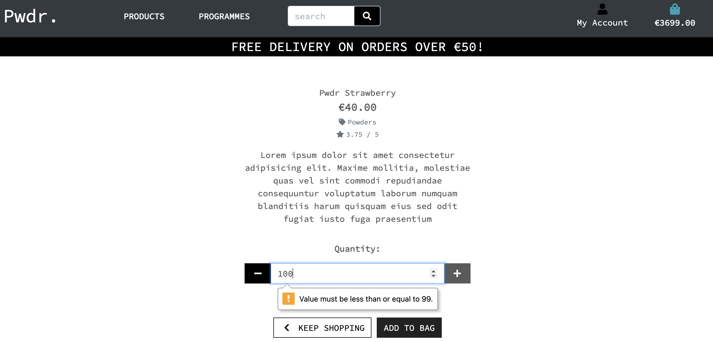

## Testing
### Manual Testing.
### Functionality

1. Search function: Home Page
    - Tested search fuctionality by submitting an empty search in order to verify that an error message appeared.
    - Result: An error message appeared, displaying the text: 'Error! You didn't enter any search criteria!'
    

    - Tested search functionality for accuracy by submitting legitimate search for various whole terms ('berry', 'workout' etc.) with all  inputs valid.

    - Result: All expected search items were returned.
    

    - Tested search functionality by submitting searches for shortened terms of three and two letters (such as 'ber''wor','ba') to see if all relevent items were returned.
    - Result: All expected search items were returned. 
    

2. Login Page:
    - Tested login functionality by submitting incorrect login details in order to verify that an error message appeared.
    - Result: Error message appeared displaying the text: 'The username and/or password you specified are not correct.'
    

3. Register Page
    - Tested registration functionality by attempting to log in using an existing username in order to verify an error message appeared.
    - Result: The registration page refreshed and displayed an error saying 'A user with that username already exists.'
    
   
    - Tested registraion functionality by attempting to log in using an existing email address in order to verify an error message appeared.
    - Result: The registration page refreshed and displayed an error saying 'A user is already registered with this e-mail address.'
    

    - Tested registration functionality by attempting to register a username using fewer than 4 letters in order to verify that an error message appeared.
    - Result: Error message is diplayed, reading 'Please lengthen this text to 4 characters or more (you are currently using 3')
    

4. Product Page:
    - Attempted to add a number of products exceeding 99 to shopping bag in order verify that an error message appeared.
    - Result: An error message popped up displaying the text "Value must be less than or equal to 99"
    

    - Attempted to add on a sum of zero products to the shopping bag in order to verify an error message appeared.
    - Result: An error message popped up displaying the text "Value must be greater than or equal to one"
    

5. Checkout Page:
    - Attempted to enter an email address without an @ symbol in order to verify the appearance of an error message.
    - Result: Error message popped after clicking complete order, reading "Please include an @ in the email address."
    
    - Attempted to include text in the phone numbers field in order to verify the appearance of an error message.
    - Result: Error message popped reading 'Please match the format requested'.
    

    - Attempted to enter an invalid credit card number in order to verify the appearance of an error message.
    - Result: An error message appeared, reading 'Your card number is invalid'. 
    

## Automatic Testing

### Validators

 - **[HTML Validator](https://validator.w3.org/):** No errors found.
    
    **Sample Results:** 
    - Bag Total.html 
    - Bag Html
    - Checkout buttons Html

- **[CSS Validator](https://jigsaw.w3.org/css-validator/):** No errors found.

    **Sample Results:**
    - 404 
    - 505 

- **[JS Hint](https://jshint.com/):** 
    
    **Sample Results:**
    -  Error:'template literal syntax' is only available in ES6 (use 'esversion: 6').
    -  Stripe_elements.js 

- **[Python validator | PEP8](http://pep8online.com/):** No errors found

    **Results:** No errors found beyond those trigger by long lines which were auto-generated during migrations.

